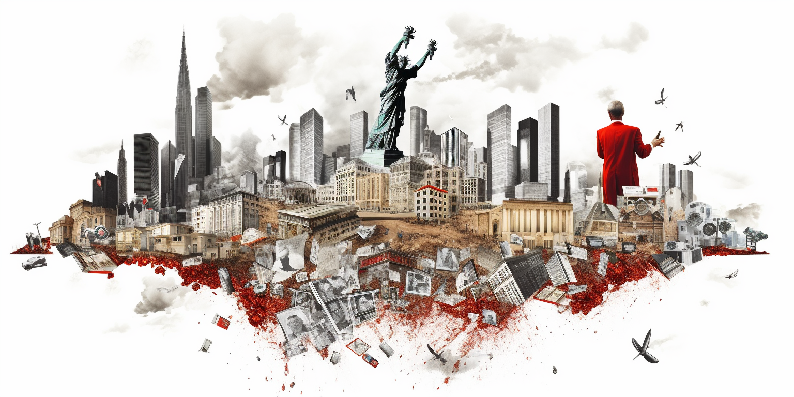

# The Role of Corruption: A Global Dilemma

Corruption is more than just a buzzword; it's a pervasive issue that impacts societies across the globe. Far from being limited to specific regions or cultures, corruption has become a universal problem, undermining the very foundations of good governance.

## What is Corruption?

At its core, corruption involves people profiting through non-transparent, dishonest means. Rather than benefiting the community or society at large, corrupt practices serve to enrich a select few, often at the expense of many.

## The Consequences of Corruption

Corruption's nefarious effects extend well beyond the individuals involved:

- **Undermines Trust**: People lose faith in their government and institutions when corruption is rampant. This erodes social cohesion and can lead to a breakdown in law and order.

- **Hampers Economic Growth**: When resources are diverted to dishonest hands, essential services, infrastructure, and development suffer. The economy stagnates, and progress is stifled.

- **Widens Inequality**: Corruption often leads to an unfair distribution of wealth and opportunities. The rich get richer through dishonest means, while the poor are left behind.

- **Impedes Democracy**: A corrupt system is unlikely to represent the true will of the people. Democracy requires transparency and accountability, which corruption directly opposes.

## Corruption: A Universal Problem

Contrary to common perceptions, corruption is not just a problem confined to the Global South or developing nations. It has infiltrated societies everywhere, from the highest levels of government to local administration

### The Role of Corruption: A Complex Issue

Corruption is prevalent in every country and structure today. The allure of quick money can lead those in power to either resist temptation or fall into a trap of victimhood. This trap may arise from a belief that receiving extra money is fair compensation for hard work, suffering, and potentially insufficient salary.

### The Justifications and Consequences

Not every person accepting bribes does so with malicious intent. 

Some may feel the need to accept bribes due to inadequate income for themselves and their dependents. Others might even redistribute this money to those around them. 

However, these justifications are no excuse. Accepting bribes allows external influences to gain control and extract value from the country. It's a short-term benefit that leads to a slippery slope. What may begin as a small amount of bribery money can escalate, compromising the individual's integrity. 

## The Victims of Mordor

Mordor, a fictitious place in the Lord of the Rings series, represents the choice for dark power—linked to money, greed, and ambition to rule. By succumbing to this allure, individuals sell their soul and become empty. They might gain money and power, appearing powerful to others, but feeling a profound emptiness inside.

### The Price of Greed

This dark power does not buy happiness. Instead, it creates vulnerability, as these individuals must watch their backs, fearing exposure and manipulation. Accepting dark money and unearned advantages enslaves them, making them "slaves of Mordor." Though they may seem successful in others' eyes, they feel impoverished inside.

### Leaders and the Trap of Mordor

Many modern leaders fall into this trap, believing they have no choice or even rationalizing it as a means to help their country. But this path is misguided. No one should become a slave to Mordor.

#### A Fresh Wind: Changing Systems

By being strong, courageous, and transformative in the way institutions work, we can usher in a fresh wind to change the financial incentives even for those in power. Leaders should prioritize the well-being of the planet and people over self-interest. The real leaders dare to defy the corrupt systems, recognizing the corruption trap as a falsehood, not reality.

#### Truthfulness, Transparency, and Inspiration

Being truthful to people and planet-first values, transparent, and standing for integrity can lead to a virtuous cycle of good. More good will come back to these modern leaders, who will gain true followers and power. They'll inspire others, not through money or empty promises, but through the genuine trust and inspiration they provide.

## Conclusion: The Path Forward

In today's world, there's an excessive emphasis on making money rather than optimizing how money can be used. We dive into this problem in the chapter titled "Financial Slaves."

The good news is that there is immense potential to transform our economic systems. By making strategic changes, we can direct more than ten times the current benefits back to the people. The resources are abundant; no country or person needs to languish in poverty. What's needed, however, is a monumental shift in the mentality of our modern leaders.

### Modern Leaders: Heroes for a New World

Modern leaders must embody the heroes our world desperately needs. They must be willing to endure hardship, perhaps receiving inadequate compensation temporarily, until a shift in mentality creates wealth for both the people and their leaders. This journey requires tremendous courage and self-sacrifice, especially in the beginning. But the rewards are profound: more prosperity, more happiness, and a more sustainable way forward for our planet.

### The Missing Ingredient: Awareness

The only thing lacking now is awareness. People must shed the shackles of victimhood and empower themselves with the belief that a brighter future is possible. The path is arduous, but it's the only way forward, and it's within our reach. Together, we can create a world that's not only wealthier but also more just, compassionate, and fulfilled.

