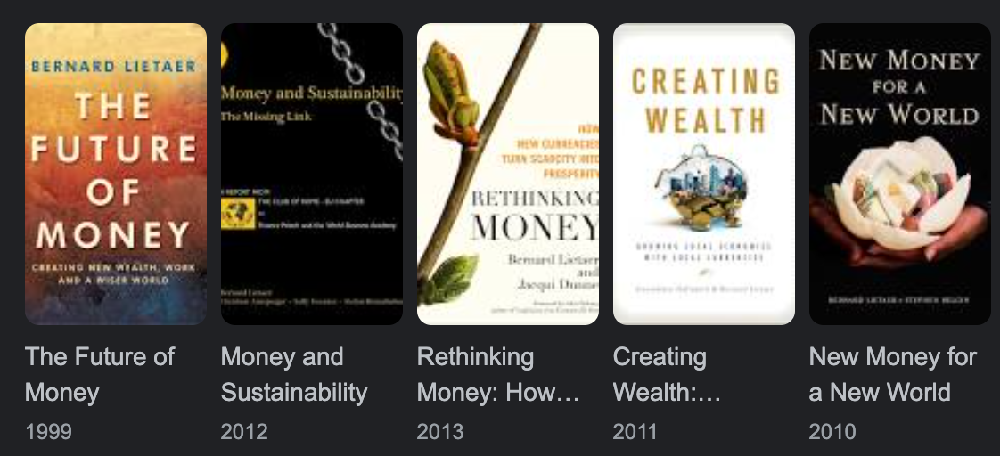

## Bernard Lietaer

When I first met Bernard, I was grappling with the concept of money. To me, money felt like a necessary evil, something that had to be managed to make progress in life.

I feel honored to have had the opportunity to spend time with him during the last months of his life.

He was an exceptional human being and his insights in the nature of money was incredible.

> Thank you Bernard for teaching me so much.

Bernard was also super kind and he allowed me to write a chapter in his last book: [Towards a Sustainable World](https://www.amazon.com/Towards-sustainable-world-Paradigm-shifts/dp/3200065273)

## His Books

- [on Amazon](https://www.amazon.com/s?i=stripbooks&rh=p_27%3ABernard+Lietaer&s=relevancerank&text=Bernard+Lietaer&ref=dp_byline_sr_book_1)

