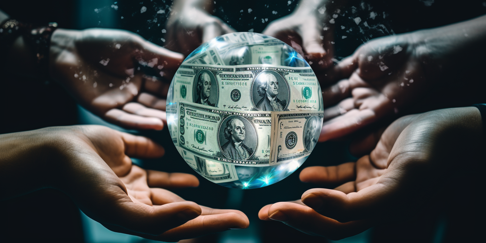

# Currencies of the Future

Bernard Lietaer, a notable expert on money, once told me, "Change the nature of money and you change the world." And I truly believe him.

We've all seen how money can become an obsession, almost like a drug, taking over our lives and leading us away from what really matters. But what if money could be a force for good? What if we could turn it into something that helps people and makes the world a better place?

In this article, we'll dive into the exciting possibilities of the currencies of the future. We'll explore how we can use money in new ways to bring about positive change and make a real difference in people's lives. So let's take a fresh look at money, not as a problem, but as a solution waiting to be discovered.

### What is money?

What exactly is money? Many of us have only known one form of it, but what if that's just the tip of the iceberg? Instead of a single, monolithic form of currency controlled by a select few, imagine a world with thousands of different kinds of money, each designed and created by the very people who use them.

Personally, I can't support a system where a few individuals wield enormous power, using money to become richer at others' expense, and then leveraging that wealth to amass even more. This is a path that's unsustainable and is showing signs of collapse even now.

We need to think differently about money. We need currencies that are not created in the shadows, benefiting only the privileged few. We need currencies that are transparent, diverse, and driven by the needs and values of everyday people. This isn't a far-off dream; it's a necessary shift we must make if we want a financial system that's fair, stable, and truly serves us all.

So we need other types of money. Money not coming out of the kitchen of Mordor. 

### Yin and Yang currencies

Bernard Lietaer introduced a fascinating distinction between two types of currencies: yin and yang. These represent two contrasting approaches to money that could exist in harmony with each other, much like the principles they're named after.

**Yang Currencies: The Fast Movers**

Yang, or male-oriented currencies, are meant to flow quickly. They're the currencies we use for our day-to-day buying and selling. They shouldn't be tied down to any one asset but should move freely, reflecting the value of the economy they support. Maybe these currencies should even be deflationary, losing value if hoarded, to encourage spending. Yang currencies can help grow a community, acting as the active force in an economy. We'll explore later how such a currency might be created.

**Yin Currencies: The Nurturers**

Yin, or female-oriented currencies, serve a different purpose. They're meant to be saved, nurtured, and allowed to grow over time. These aren't currencies to be spent quickly; they're investments, like seeds in the ground, waiting to blossom. Examples might include digital co-ownership of land, art, or even farming businesses.

Yin currencies might also include pre-financing arrangements that give farmers time to grow their crops, with a return for investors when the product reaches the market. These are solid, stable currencies, immune to sudden crashes. Co-ownership encourages collaboration over competition, with the shared goal of maximizing value over time. It's like aging a fine wine, waiting for the perfect moment to enjoy it.

**Harmonizing Yin and Yang**

The yin and yang currencies aren't mutually exclusive but complementary. Yang currencies foster growth and movement, while yin currencies provide stability and long-term value. Together, they represent a balanced approach to money that encourages both immediate transactions and future planning.

Imagine a world where money is not just a single, monolithic tool but a diverse ecosystem reflecting different needs and values. By embracing the principles of yin and yang in our approach to currency, we might build a more fair and responsive financial system that truly serves the diverse needs of its users.

### Everyone should be able to create their own complementary currencies!

We need a world where creating personal complementary currencies is not only possible but encouraged! Imagine a system where small circles of people, even just twenty individuals, can come together and create their own yin or yang currencies. And not just in a haphazard way, but in a well-structured and regulated manner that still promotes flexibility and quick execution.

This approach opens the door to a whole new way of thinking about money. It allows communities to tailor their financial systems to their unique needs and values. It's a way to harness the collective power of a community and put it to work in a meaningful, controlled way without the risk of abuse.

This could be the future of money – a system that's not controlled by a few but built by many. A system that doesn't just serve the global economy, but reflects the diversity and creativity of the people within it. The creation of these personal currencies might be the key to unlocking a more inclusive and empowering financial future for all.

### How can a male currency be created?

Male currencies are unique in their nature. Consider a small, sustainable community, such as a city, filled with local retail shops, restaurants, medical practitioners, farmers, and other essential services. What if this community decided to create its own currency? Let's name it Maya, like a fire currency.

Here's how it could work:

* **Community Collection** :
    * The community collectively decides to establish a decentralized bank, like a community-owned treasury. Imagine this community pooling together 10 million dollars.
* **Backing with Stability** :
    * To ensure stability, the treasury could be backed by gold. So if the community puts in 10 million dollars, another 10 million dollars' worth of Maya is created out of thin air. This newly minted currency would be backed by gold.
* **The Treasury** :
    * Now you have a treasury with a 50-50% distribution between gold and the created currency called Maya.
* **Liquid Currency** :
    * This currency, Maya, is worth 10 million dollars and is used for as many as possible daily activities within the community.
* **Recycling Money** :
    * Suppose the community is recycling their money once a month, and there's 20 million dollars flowing around within the community. Since there are only 10 million Mayas, the value of Maya must double.
* **Increasing Maya's Value** :
    * But since Maya was only created when the treasury was formed, how can it increase in price? How do people get Maya if it's not available or if nobody wants to sell it?
* **Liquidity Pools and Mechanisms** :
    * There are provisions for liquidity pools and mechanisms in the system, allowing people to buy Maya using assets like gold or dollars. 
* Balancing Treasury: 
    * As people buy Maya with dollars, those dollars are converted to gold, increasing the gold in the treasury. But to maintain the 50-50% balance between gold and Maya, the price of Maya must rise.

By carefully managing these elements, a community can create a male currency that meets its needs. It's a model that puts control in the hands of the people and fosters a self-sustaining financial ecosystem. It's a printed currency, not controlled by a central authority but by the community itself, backed by tangible assets and adjusted by community needs and behaviors. This example of Maya offers a glimpse into what's possible when we think outside the conventional currency box.

### A Dual Currency System is very Stable

A Yang-based currency like Maya offers stability, unlike standard economic systems that rely on currencies such as the dollar. In traditional systems, a mere 10% downturn in the economy might lead to a dramatic crash in the currency. That's because these currencies are often over-leveraged and lack real backing. In contrast, the Maya system avoids such pitfalls.

Here's how the Maya system works:

* Stability Through Backing: 
    * With 50% backing in gold, a 10% decline in the economy would likely only have a 5% impact on the value of Maya. This gold backing adds an extra layer of stability.
* Community Expansion and Value Growth: 
    * As the community's economy expands, the value of Maya rises. This increase directly benefits the community since it's a 100% community-driven currency.
* Dynamic Value Movement: 
    * If the economy contracts, Maya's value will decrease gently, providing a currency that moves up and down slowly in response to economic changes. This creates a stable male currency that builds trust.
* Community-Centric Approach: 
    * Each community would ideally have one Maya currency to maximize liquidity and velocity, which in turn increases its value.
* Complementary Female Currencies: 
    * Alongside male currencies like Maya, female currencies focused on pre-financing or holding value in co-owned assets offer ways to finance the future without risking loss.
* Benefiting the People: 
    * This combination of male and female currencies creates a stable currency system that's not manipulated. It's entirely for the benefit of the people who co-own that money system.
* Avoiding Manipulation and Interest: 
    * This system can be created without manipulation. It also sidesteps the need for interest, offering a more ethical and prosperous money system for all involved.

In summary, a Yang-based currency like Maya presents a groundbreaking approach to community economics. By leveraging its value through local expansion, ensuring stability through gold backing, and complementing it with female currencies, the Maya system offers a path towards a more inclusive and responsive economic model. It's a system designed to provide stability, trust, and direct benefit to the community, proving that alternatives to conventional currency systems aren't just possible but advantageous for everyone involved.