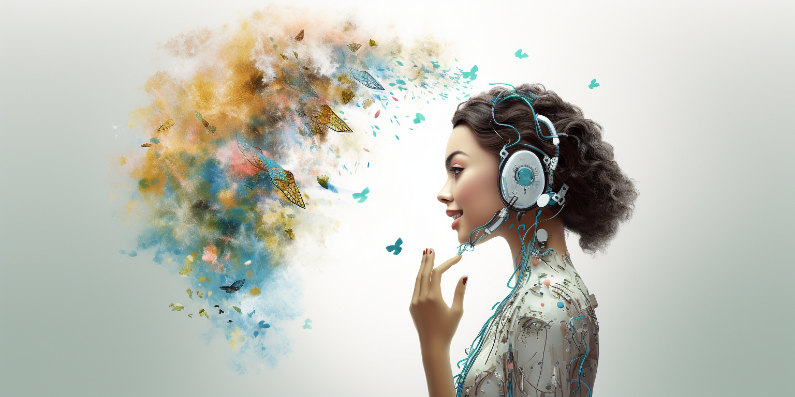

# Introduction

In today's fast-changing digital world, the lines between what's real and what's online are fading. As we become more connected, a new idea is taking shape that's like a mirror image of ourselves in the digital world. This idea, called a "digital twin," not only shows who we are but can also help us do things in new and exciting ways.

## What is a Digital Twin?

A digital twin is like a computerized buddy that reflects who you are. It's not just a picture or a profile; it's a living version of you online that changes as you change. It looks like you, likes what you like, and can even think like you, thanks to smart technology.

## You Own It

What's really special about your digital twin is that you own it. It's not controlled by big companies or the government; it's all yours. That means you're in charge of how it looks and acts, and what information it knows about you.

Because you own it, you have to take good care of it. You need to make sure it stays safe and really shows who you are.

## More Than Just You

The digital twin isn't just about one person; it's a big idea that can change how we all live online. It helps make our online world feel more real and personal.

In a world where our information is often used by others, the digital twin gives the power back to us. It's a step towards a future where technology helps us be ourselves, instead of telling us what to do.

## Don't be a product

In today's digital landscape, our personal information, preferences, and behaviors are often treated as commodities. Large corporations like Google, Facebook, and Amazon amass vast amounts of data about us. These details are analyzed, packaged, and often sold to advertisers or used to target us with personalized marketing. In essence, we, the users, have become the product. Our individuality is distilled into data points, our privacy eroded, and our autonomy over our digital selves weakened.

The digital twin concept fundamentally challenges this paradigm.

- **Ownership and Control**:
  - With a digital twin, you own your virtual self. Unlike profiles managed by big tech companies, the data and behaviors of your digital twin are under your control. You decide what information is shared, with whom, and for what purpose. Your digital twin represents you authentically, without the filter of corporate interests.
- **Privacy and Security**:
  - Your digital twin can act as a shield, interacting with digital platforms on your behalf without revealing personal or sensitive information. While your digital twin can access the services of Google, Facebook, or Amazon, it does so in a way that prioritizes your privacy, ensuring that you are not unknowingly turned into a product.
- **Collaboration without Exploitation**:
  - Imagine a network of digital twins, interacting and collaborating without the oversight of a central corporate entity. This peer-to-peer model allows for genuine, meaningful connections and shared knowledge, free from the influence of algorithms designed to monetize our relationships
- **Personalized Experience without Personal Sacrifice**:
  - Digital twins can provide personalized experiences based on your preferences and needs without relying on external platforms that might misuse your information. Your digital twin knows you intimately but serves only your interests, not those of advertisers or corporations.
-  **A New Digital Ethos**:
   -  The concept of the digital twin reimagines the contract between individuals and the digital world. It redefines what it means to be a digital citizen, placing the emphasis on individual sovereignty, communal collaboration, and ethical engagement, rather than commercial exploitation.

## Conclusion

The digital twin is a revolutionary idea that challenges our traditional notions of identity, agency, and reality. It heralds a future where we are no longer mere passive consumers of digital technology but active participants in shaping our digital destiny. As we venture further into this brave new world, the digital twin stands as a beacon, guiding us towards a more enlightened, empowered, and connected existence.