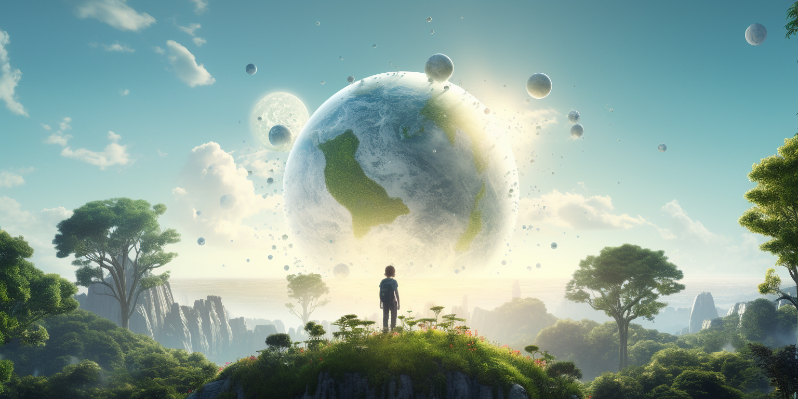

# Introduction: A World at the Crossroads

I personally believe, all it takes to resolve the issues we currently face on our beautiful planet is help to grow awareness.

> This book is written like "source code" and needs to be expanded upon, this also only a start, we would like to invite everyone to contribute and give their remarks.

## Our world is standing at a crossroads.

Leaders of countries are like travelers at this crossroads, and they often find it hard to choose the right path. There are voices around them, whispering in their ears, telling them which way to go. Some of these voices are kind and wise, caring for the land and the people. But some voices are driven by greed or fear. 

These voices, don't care about the fields or the forests; some care about what they can take for themselves, others are mainly driven by fear and they believe aggression might be a necessary evil.

These greedy or angry voices are loud, and they make it hard for leaders to hear their own hearts. They make it hard for leaders to choose the path that is good for the earth and for the people.

We hope this book can be like a gentle breeze. It wants to carry the voices of hope and wisdom from mother earth and its residents to its leaders and governments. 

The gentle breeze want to cover topics like:

* Money: What is it? Why does it have so much power? Can we use it for good?
* Sovereign Countries: Why is it important for a country to make its own choices and stay strong?
* Hope for the Youth: How do we make sure our young people grow up with hope and dreams?
* The North vs The South: colonization is still on and we are active participants.
* Digital Tools: Can computers and the internet help us learn, heal, and grow?
* Education and Healthcare: How can we make sure everyone gets to learn and stay healthy, no matter where they live?
* What is the role of the Internet in all of this?
* Cyber Security: How do we keep our information safe in a world full of technology?
* Earth and Desert: How do we take care of our land so it doesn't become a desert?
* Climate Change: How to help battle climate change in line with economic ambitions?

These are big questions, and finding answers won't be easy. But we believe in the goodness of people and the strength of the earth. We believe that if we listen to our hearts and work together, we can choose the right path.

Together, we'll explore these topics, guided by the values of caring for our planet and people first. We'll find the wisdom and kindness that can help our leaders make good choices.

This is our journey, and we invite you to walk with us.

With this book our attempt is to set the stage for an exploration of the complex and essential themes that guide our world today. We recognize the challenges, but also sow the seeds of hope and shared values.

> This book is written in a very dense form like source code, there are lots of concepts in side which will need more expansion. The book might be hard to read as such.

