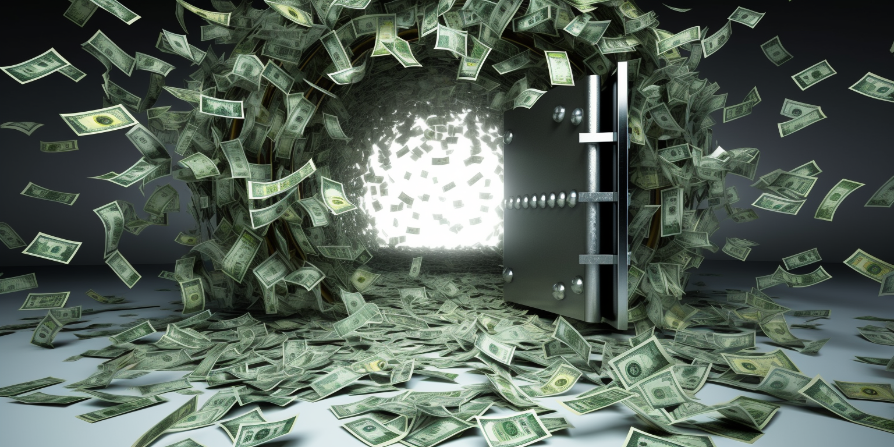

# Money is a taboo

Strangely, for something so integral to our daily lives, money is a taboo topic for most. The average person tends to know surprisingly little about how money really works, especially in the context of the banking system. 

Many of us believe or at least used to believe, that when we deposit our hard-earned cash into a bank, it's simply being kept safe, stored away in a vault until we need it again. We also tend to think that banks make their profits solely by lending this money to others and collecting interest on those loans, taking a margin in the process. 

But as we will uncover in this chapter, the reality is far more complex and also worrisome. 

## Some surprising facts

Quite some central banks around the world are not owned by the countries in which they operate. In some instances, even the tax institutes within certain nations are not owned by the country itself. Monetary institutions, such as central banks, possess the ability to print money if necessary, receiving debt in return on which they make a profit. They are often highly lucrative organizations. The money they make is channeled into large sovereign funds, which are then used to back major investors. 

But beneath the surface, there's a murky side to this system. Some argue that it's all part of a corrupt game. This complex world, including the Investment game of Silicon Valley, deserves closer examination, and I'll explore it further in a subsequent chapter.

The manner in which money functions, specifically through the continuous printing at both the central bank and commercial banking levels—often driven by means of interest—leads to a constant erosion of money's value. This process is a fundamental contributor to the boom and bust cycles that characterize modern financial systems. Money, it seems, is designed to crash. 

Over the last six decades, the evidence of this pattern is stark, with more than 600 monetary crashes recorded. This recurring phenomenon raises critical questions about the underlying stability and sustainability of our economic structure, challenging our perceptions of money's role and revealing the fragile nature of financial markets.

More than 600 monetary crashes in six decades is a staggering number. It reveals a fundamental truth: money is not a stable commodity. Its value is not grounded in tangible assets or intrinsic worth but is merely a matter of belief. At the top of the financial hierarchy, there are monetary institutions, employing various strategies and tricks to maintain the perceived value of money. This delicate balancing act is a continuous challenge, a game of confidence and manipulation that underscores the fragility and complexity of our financial system.

## Fractional banking system

When you put your money into a bank, they don't just keep it all in a big vault. They only keep a small part of it, and they lend the rest to other people. So, if you deposit $100, the bank might keep $10 and lend out $90 to someone who wants to buy something.

Now, the person who received that $90 might pay it to someone else, who then puts it in their bank. That bank does the same thing: keeps a small part and lends the rest. This process keeps going on and on, with the same money being lent, spent, and deposited again and again.

While this is happening, the bank charges interest on the money it lends out. So they're making money on the loans, even though they only have a small part of the original deposit in reserve.

It's a bit like a chain reaction, where the original deposit sets off a series of loans and spending that makes it look like the money has multiplied. In a way, it seems like the banks are making money out of nothing, but really, they're just using the same money over and over again and collecting interest on it.

## Banks print money

Today, the way banks handle money might seem almost like they have a license to print. 

This process is different compared to what most of us imagine, and it's rooted in mechanisms like interest and debt. In our view, debt and interest, a fundamental aspect of modern banking, should perhaps not even be allowed. It's a puzzling system: Interest essentially creates money that didn't exist before.

 Imagine a closed-loop system where there are only 1000 euros, but a person needs to give back 2000 euros. Where does the additional 1000 euros come from? It never existed in the first place; it was never printed. So interest, and especially compound interest, leads to money creation, which in many ways is the most substantial form of money creation there is. 

Banks are permitted to do this, and in fact, they can lend much more than the money deposited with them, sometimes more than ten times that amount. This process raises questions and concerns that we'll explore further, unraveling the mystery of how banks truly operate in our financial system.

## Banks can borrow money from central banks

Banks can borrow money from the central bank, and the deposits that individuals and businesses place in the bank play a role in this process. 

When you put money in a bank, the bank doesn't just sit on that money. It uses a portion of it to make loans to other customers, but it also has to keep some of it on hand, either in its own vaults or in reserve with the central bank. This is to make sure that there's always enough money available for people who want to withdraw their deposits.

Sometimes, a bank might find that it needs more money than it has in reserve, either because lots of people are withdrawing their money or because the bank sees an opportunity to make more loans. In that case, the bank can borrow money from the central bank. The ratio between what they borrow and own in reserves can be big.

## Exchanges and Forex is not based on Supply and Demand

Another widespread misunderstanding is the belief that the Forex or Stock exchange systems operate solely on the principle of supply and demand. This is not accurate. 

The prices of many commodities, including money, are often influenced by powerful entities at the apex of the financial hierarchy. Together, these groups define the price. The real money is made on the difference between the buying and selling prices, known as the spread.

In this system, money is distributed over exchanges from the top down. At the highest levels, like global investment banks such as Merrill Lynch, the spread is small, meaning the difference between buying and selling is minimal. Despite this, because the volumes traded are immense, significant profits are made.

This distribution continues down to smaller institutions, with spreads increasing and volumes decreasing at each level. At the bottom of this pyramid, you'll find offshore, Forex, and sometimes even shady crypto organizations, where the spreads and margins are enormous, but the volumes are smaller.

Crypto trading is unique in that both volumes and spreads can be large, leading to a system that has become corrupted over time. While new regulations are being implemented, the fundamental nature of making money on the differences remains the same.

The shocking truth is that most financial investors or institutions don't make money on the absolute value of assets like Bitcoin or Company Stock. They don't care if Bitcoin's price is $60,000 or $30,000. The big investors are not working for small margins, like a 100% increase )-: They make money on daily percentage changes, such as 2% differences between buying and selling, which can accumulate to 700% or more annually. This manipulation allows them to easily earn tenfold or twenty fold returns within a year by simply playing the market.

Such manipulation is a common practice in Forex, Stock exchanges, and Crypto trading. The only difference is the size of the spread. Leverage instruments are created to enlarge these spreads, sometimes allowing 50 or 100 times the leverage. This system usually ends up being more detrimental to small individual investors, who are more likely to lose, while the big players—akin to the house in a casino—almost always win.

It's an uneven playing field, where the elite define prices and manipulate them daily. Those at the bottom become victims of a system akin to gambling addiction. The financial hierarchy is a money-making machine where those at the top can never lose, and the more power and money they have, the easier it is for them to manipulate prices.

This manipulation can even be observed in the gold market. Despite being a scarce resource, the price of gold has moved relatively little over the past 20 years. This phenomenon is likely due to the large amount of "paper gold," or gold that is bought in banks but is not physical gold. This allows for the creation of bubbles and the same "pump and dump" strategies seen in other asset classes like money or crypto.

In summary, the financial system is far more complex and manipulated than it appears. The notion that prices are solely determined by supply and demand is a simplification that doesn't account for the intricate strategies and manipulations conducted by powerful institutions. Understanding this underlying complexity is crucial for anyone dealing with money, as it paints a more realistic picture of the financial world's intricate and often unfair workings.

## Banking is a very profitable business

Banks have a knack for making money in various ways, and this capability allows them to enjoy high margins. One of the primary ways they do this is through the interest rate spread. Imagine you deposit money in a bank, and they pay you 1% interest. They then take that money and lend it to someone else at 4% interest. The difference, that 3% gap, goes straight to the bank, and this difference adds up quickly when considering the vast amounts they deal with and the leverage they have to multiply your money.

In addition to this, banks make a good chunk of their money through fees. Every time someone uses an ATM from a different bank or goes below their account minimum or overdrafts their account, there's a fee attached. These might seem like tiny amounts, but multiply them by thousands or millions of customers, and it becomes a significant revenue stream.

Another avenue of income for banks is their investments. They take some of the money deposited with them and invest it. If those investments turn out well, the bank profits. Another very lucrative way banks make money is through leveraging. Essentially, they are allowed to lend out more money than they actually have. So, they might earn interest on, say, $100 when they only really have $10 in the vault.

Then there's the trading and investments side of things. Banks often buy and sell currencies, stocks, and other assets. If their predictions about market movements are accurate, they stand to gain a lot. Moreover, they offer specialized financial services, like managing investments or consulting, which they charge for. Managing the investments of wealthy clients can be especially profitable.

But with high rewards come high risks. Some of the methods banks use to make money, like investing borrowed funds, come with a potential downside. However, if these risks turn out in their favor, the rewards, or in this case, profits, are substantial.

## Money is not a stable asset

Money has long been considered a stable asset, but the reality is that it's more like an ever-inflating balloon, bound to crash at some point. This crash nearly happened in 2008, sending shockwaves across the financial system. It was a grim reminder of how fragile our financial infrastructure really is. Yet, thanks to the seemingly endless ability to print money, the free fall was halted just in time, saving us from a complete financial collapse.

Fast forward 15 years, and there's more money in the ecosystem than ever before. The constant printing has continued, eroding the value of money even further. This can't go on indefinitely. The powers that be are well aware of this, and their current strategy isn't just about printing more; it's about controlling the movement of money globally. They're trying to restrict liquidity, not within their gambling machines, where the game remains the same, but across international borders to protect the American system and the value of the dollar.

This approach has led to a perilous situation, heightening tensions and even raising the specter of a third world war. The game of money has evolved into a dangerous geopolitical divide, with China, Russia, and their allies on one side, seeking stability in assets like gold, and the US and the West on the other, clinging to the US dollar and the euro.

It's mind-boggling to see Europe, the UK, and other nations allowing themselves to be ensnared in this game, becoming virtual slaves to the US, lending vast sums and losing their autonomy. Europe, in particular, seems vulnerable, lacking the strength to stand on its own.

These manipulative games have an endpoint, though. Many institutions are now using their immense wealth to take up positions across the world, particularly in emerging countries. They're buying land and assets, leveraging their financial clout to dictate the future of entire nations. Violence becomes a potent tool in their arsenal. All of this is possible largely because people, including leaders of many countries, fail to understand money. They succumb to corruption, feeling powerless to create their own future.

This complex and sometimes terrifying game of money reveals a global landscape fraught with risk, manipulation, and unseen power plays. What's clear is that the money game is far from simple, and the stakes are higher than ever. It's a sobering thought that our lack of understanding and complacency about money could have consequences reaching far beyond our wallets and bank accounts, influencing the very future of nations and global stability.

## Let's together change the nature of money.

Imagine money as a tool, not a trap. Today, many of us see it as a dark force that controls our lives, making the rich richer and leaving the rest of us behind. It's like we're caught in a never-ending cycle, chasing something that always seems just out of reach.

But what if we could change that? What if money could be something beautiful, a symbol of our energy, our time, our dreams? My friend Bernard Littard once shared a simple but profound idea with me: "Change the nature of money, and you change everything."

It's time for us to take back control and redefine what money means to us. Instead of being slaves to a system that only benefits a few, let's create a future where money supports our communities, our projects, and our shared goals.

We can dream of currencies that represent real value, like the hard work we put into our businesses, the care we give to our families, or the love we share with our neighbors. Money can be more than just numbers on a screen; it can be a reflection of who we are and what we believe in.

We don't have to settle for a world where money divides and corrupts. We can choose a different path, one where money brings us together and helps us build something beautiful. It's a choice that requires courage, imagination, and a belief in ourselves and each other.

The current system, like a balloon inflated beyond its limit, is bound to burst eventually. But we have the power to create something new, something strong, and something real. Together, we can make money a force for good, a tool that empowers us to live better lives and make our world a better place.

The future is in our hands, and the possibilities are endless. Let's embrace the opportunity to change money, and in doing so, change everything.

