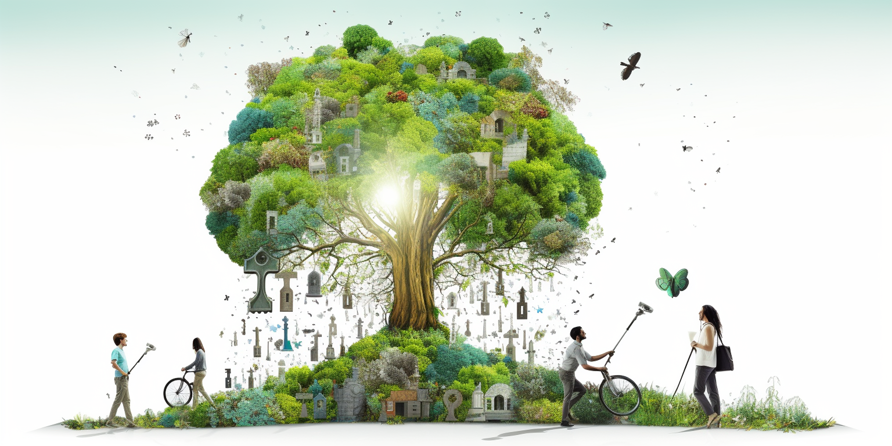

# Regenerate Mother Earth

# Mother Earth

Mother Earth is generous, nurturing, and unconditionally giving. She offers us everything we need to sustain life, from the fertile soil that grows our food to the fresh water that quenches our thirst. Yet, we find ourselves at a critical crossroads in our relationship with her. Our approach to using her resources has become one of extraction, domination, and short-term gain. In our haste to take what we want, we are neglecting to honor the delicate balance that sustains us.

### Embracing the Female Energy

Mother Earth embodies female energy, one of care, compassion, and abundance. Her generosity knows no bounds, but like any mother, she needs love and respect in return. By seeing the Earth as a living, breathing entity, rather than a collection of resources to exploit, we can begin to nurture a more harmonious relationship with her.

### Rethinking Our Approach to Resources

Our current methods of mining, farming, and manufacturing are often driven by a desire to maximize profit at any cost. This has led to widespread erosion, pollution, and destruction of habitats. By embracing more sustainable and thoughtful practices, we can support the planet's natural cycles, preserve biodiversity, and ensure that future generations can enjoy the abundance that Earth has to offer.

### Connecting Mind and Heart

Our intellect has driven tremendous technological advancement, but it has also led us down a path of disconnection from nature. To truly honor Mother Earth, we must learn to balance the wisdom of the mind with the compassion of the heart. This means recognizing the intrinsic value of the environment and treating it with the same respect and care we would a beloved family member.

### A Path Forward

The future of our relationship with Mother Earth lies in our hands. By shifting our focus from ownership and extraction to stewardship and sharing, we can create a world where prosperity is measured not just in material wealth but in the richness of our connection to the land and each other. We must learn to see Mother Earth not as something separate from ourselves but as an integral part of who we are. By aligning our actions with the principles of sustainability, empathy, and respect, we can heal the wounds we have inflicted and foster a relationship with the Earth that is filled with love, understanding, and mutual support.

## Let's honor mother earth:

### Improve Agriculture

Synthetic fertilizers and mass farming practices have become a grave concern for our environment. These artificial enhancers enable farmers to extract nutrients from the land rapidly, but they also leave the soil depleted and lifeless. Over time, fertile land can turn into a desert-like wasteland, stripped of its natural vitality. Farmers, often caught in a system that prioritizes immediate gain over long-term sustainability, find themselves trapped in a cycle that damages both the land and their livelihoods. The alarming transformation of once-rich soil into barren ground serves as a stark reminder: we must reevaluate our farming methods to preserve the bounty of Mother Earth.

Permaculture and food forests work in harmony with Mother Earth, employing sustainable practices that mimic natural ecosystems to rejuvenate the soil, increase biodiversity, and provide abundant food, creating a resilient and balanced relationship between human needs and the environment.

### Stop Flight to city

The migration of people to massive cities, particularly in Africa, is a complex and troubling trend that is having a dramatic effect on the land. As people leave rural areas seeking opportunities and financial stability in urban environments, they often abandon the land that once sustained them. Without proper care and cultivation, this land begins to erode, leading to the expansion of desert-like conditions.

This movement towards urban living might seem like a pathway to prosperity, but it can exacerbate problems related to sustainable food production. As more people concentrate in cities, the pressure on infrastructure and resources mounts, and the connection to traditional, sustainable agricultural practices weakens.

Moreover, this migration is not needed. There is ample land available, and with proper management, education, and investment in sustainable farming methods, these rural areas could thrive rather than deteriorate. By focusing on local solutions and empowering communities to harness the natural abundance of their environment, we can reverse the trend of land degradation and create opportunities that don't force people to abandon their homes for crowded cities.

Ultimately, this issue highlights a fundamental misunderstanding of our relationship with the land and our ability to live harmoniously with nature. Instead of viewing the land as something to be conquered or exploited, we must recognize its intrinsic value and work to nurture it, ensuring that it continues to sustain future generations. The movement towards cities might seem like progress, but without a careful reevaluation of our priorities and practices, it could lead to long-term environmental damage and lost opportunities for sustainable growth.

## Climate Change

Carbon, often regarded as a major environmental issue, is actually a key to unlocking prosperity and healing the land. 

Let's look at how this works, using the example of hemp, a plant known for absorbing carbon efficiently.

* Planting Hemp for Carbon Capture: When you plant hemp, it pulls carbon out of the air. This carbon is essential for the plant's growth and helps restore the land that might have suffered from erosion.
* Transforming Carbon into Useful Products: The carbon absorbed by the hemp can be used to create things like hempcrete, a building material. Hempcrete continues to pull in carbon from the atmosphere even after it's been used to build something. Imagine constructing buildings that help clean the air!
* Creating Biochar for Energy and Fertilizer: The same plant can also be heated in a controlled way to produce biochar, a carbon-rich substance. This process generates electricity as a by-product. Moreover, biochar, when mixed with fast-growing algae, becomes an organic fertilizer that can revitalize barren land.
* Innovations in Paper and Energy Storage: The process doesn't stop there. Mushrooms can replace traditional sources of paper as they grow much faster than trees. We can also use biochar in batteries and ultracapacitors, creating energy storage from natural resources like hemp or soybeans.

Cement stands as a prime example of a harmful and polluting element in our modern world. The way it's produced and utilized is causing significant damage to the planet, turning our cities into concrete jungles that are as unappealing as they are harmful. But nature itself provides alternatives. Rather than continuing to rely on such damaging substances, we need to turn our attention to the natural world, seeking solutions and methods that are grown and fostered by nature itself. By embracing what nature has to offer, we can pave the way for more sustainable and harmonious living.

A Shift from Extraction to Sustainability: These methods stand in stark contrast to traditional mining and extraction practices that focus on finite resources. 

So, why aren't these practices more widespread? The answer often boils down to industry's focus on short-term profit over long-term environmental harmony. These innovative methods, though available, are overshadowed by the pursuit of immediate financial gains. By controlling supply, industries can control the price, leading to more profit but less sustainability.

By embracing these natural techniques, we can not only capture and utilize carbon but also pave the way for a sustainable future that respects and harnesses Mother Earth's abundant resources. It's a full-circle approach that connects environmental care, technology, and economic wisdom, turning what we once saw as a problem into an incredible opportunity.

## Let's Regenerate our land

Let's envision a world where we actively **regenerate land**, working in harmony with nature, and fostering community ownership. We possess the means to restore broken land, and imagine if this rejuvenation were supported by a network of community-owned companies. These companies would be granted rights by their countries to keep the lands they restore.

Picture these **"earth regenerators,"** facilities capable of producing organic fertilizer, electricity, organic fuel, and even internet and irrigation. These regenerators enable communities to become self-sovereign, co-owning facilities that forge their own futures.

The organic fertilizer generated can be used to cultivate **food forests, permaculture,** and alternative farming methods. Working with the land doesn't have to be tedious or burdensome; it can be an engaging and fulfilling activity. We firmly believe that connecting with nature leads to a more profound connection with life, fostering happier and more content individuals.

Contrast this vision with the current trend of people fleeing to **concrete cities** where happiness is elusive, respect is scarce, and decent living standards are often out of reach. Many end up in menial jobs that barely support their families.

Wouldn't it be profoundly better if people were esteemed citizens living on beautiful, restored lands, working hand in hand with nature? Imagine them drinking clean water, eating nutritious food, and living joyfully in prosperity. It's not just a dream; everything needed to make this a reality is already available. **We just need to choose it.**

By embracing this way of life, we not only empower individuals to lead more fulfilling lives but also aid the planet in healing its broken lands. This sustainable living model can support even **10 billion people** in living prosperously without hunger. The power to create this world lies within our hands; the only thing left is our collective will to make it happen.